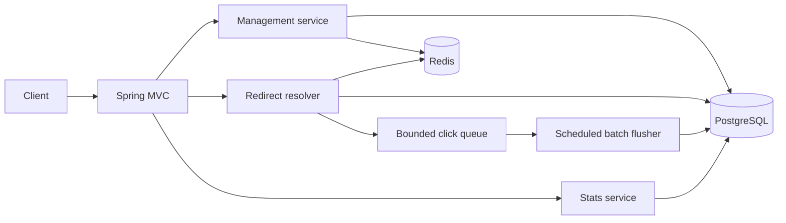

# Implementation Architecture

The service is a modular Spring Boot application with three paths:

- **Management:** anonymous create/read/delete APIs, SSRF validation, alias validation, collision retry, soft delete, and cache eviction.
- **Redirect:** Redis cache-aside lookup with PostgreSQL fallback; cache failures fail open and database failures return `503`.
- **Analytics:** successful redirects enqueue privacy-preserving events without blocking; scheduled batches persist them for aggregate queries.
- **Operations:** Flyway migrations, JSON logs with correlation IDs, health/readiness endpoints, OpenAPI, and a static dashboard.

PostgreSQL is authoritative. Redis is disposable acceleration except for the prototype rate limiter. Cache TTL is bounded by remaining link lifetime so expiry and deletion semantics are preserved. See [design.md](design.md) for per-requirement diagrams, trade-offs, data model, and the partitioned 100M-user scale design.

Authentication is intentionally out of scope for this prototype. A production version would issue a unique bearer token after user authentication, store only a token hash or identity reference, and authorize metadata, analytics, and deletion against link ownership. A shared token embedded in the browser is explicitly rejected.
