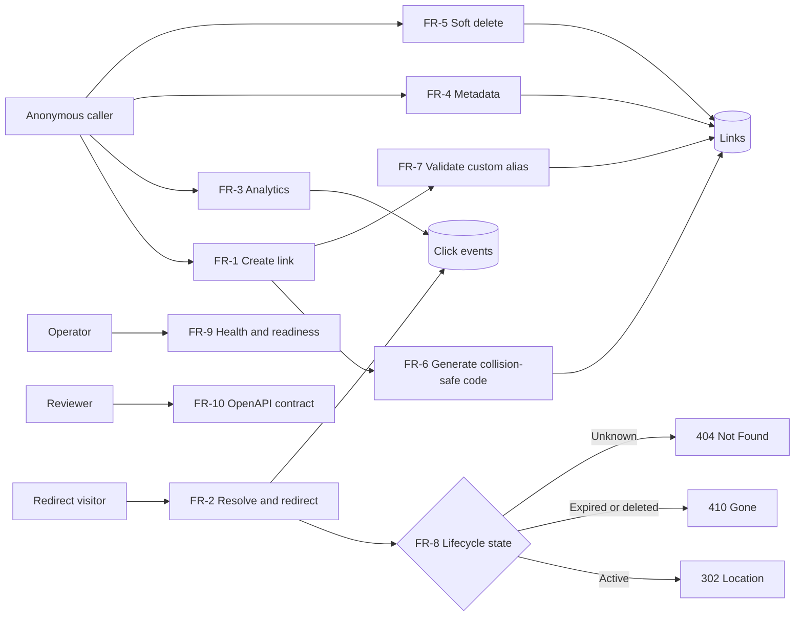
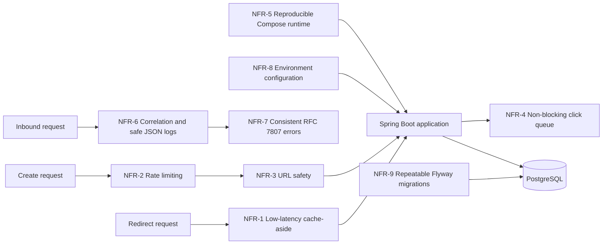
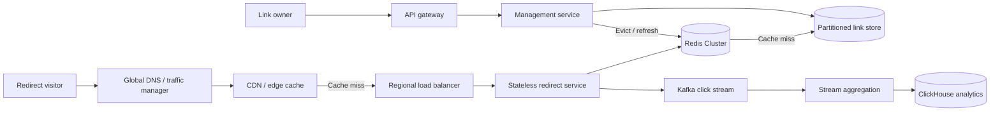
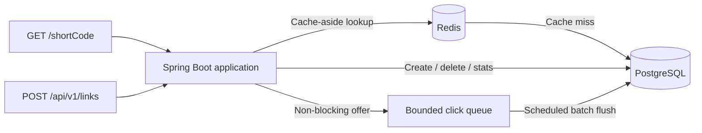
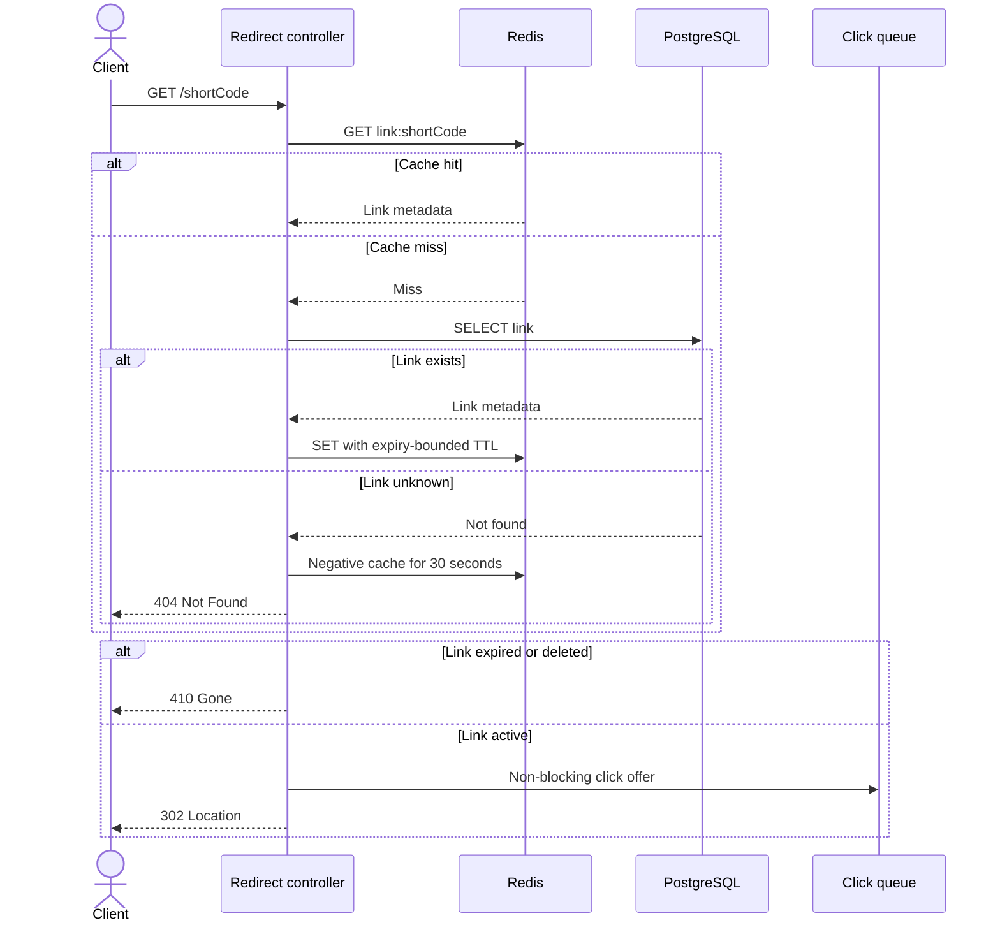

# URL Shortener — Design Specification

**Stack:** Java 25 · Spring Boot 3.5 · PostgreSQL 16 · Redis 7 · Maven
**Document status:** Implemented and validated prototype.
**Cross-reference convention:** `§n` refers to a section of this document; references to another document are written with its filename (`SCENARIOS.md §2.4`).
**How to read this:** every decision states what we chose, why, and what it cost. The costs are real and stay in the document — a design with no stated downsides hasn't been thought through.

---

## 1. Problem statement

A service that maps long URLs to short codes, redirects on lookup, records click analytics, and remains available under read-heavy load.

The single most important property: **reads dominate writes by roughly 100:1.** Nearly every architectural decision below follows from that asymmetry.

### Scope boundary

| Built and tested | Documented, not built |
|---|---|
| Single Spring Boot node | Read/write service split |
| Postgres + Redis via Compose | CDN / edge redirect |
| Full API, URL safety, analytics | Kafka click pipeline |
| Graceful degradation | Sharding, multi-region, replicas |

Design targets in §3 describe a production deployment. This prototype targets correctness, testability, security posture, and graceful degradation on one node. Stating the gap is deliberate — the alternative is quoting throughput figures the prototype can't deliver.

---

## 2. Requirements

### Functional

| ID | Requirement |
|---|---|
| FR-1 | `POST /api/v1/links` creates a short link with optional custom alias and expiry |
| FR-2 | `GET /{shortCode}` redirects an active link with `302` |
| FR-3 | `GET /api/v1/links/{shortCode}/stats` returns aggregate click analytics |
| FR-4 | `GET /api/v1/links/{shortCode}` returns link metadata without PII |
| FR-5 | `DELETE /api/v1/links/{shortCode}` soft-deletes a link |
| FR-6 | Generated short codes are collision-resistant and retry safely on collision |
| FR-7 | Custom aliases are format-, reserved-word-, profanity-, and collision-validated |
| FR-8 | Expired or deleted links return `410`; unknown links return `404` |
| FR-9 | `/healthz` reports liveness and `/readyz` reports dependency readiness |
| FR-10 | OpenAPI documents endpoints, schemas, anonymous access, and errors |



| ID | Chosen design | Trade-off accepted |
|---|---|---|
| FR-1 | One synchronous transaction returns durable metadata | Higher write latency than acknowledging queued work |
| FR-2 | `302` on every active lookup | More infrastructure traffic than browser-cacheable `301`, but preserves revocation and analytics |
| FR-3 | Event-derived, eventually consistent aggregates with `asOf` | Results can lag and raw events require retention management |
| FR-4 | Anonymous metadata endpoint with no PII fields | Anyone who knows a short code can inspect its metadata |
| FR-5 | Soft delete plus cache eviction | Rows remain until archival and cache invalidation must be correct |
| FR-6 | Eight-character CSPRNG Base62 code with insert-and-retry | Occasional failed insert instead of predictable sequential allocation |
| FR-7 | Shared namespace and database-enforced uniqueness | Alias inserts can return `409`; profanity lists require maintenance |
| FR-8 | Preserve tombstones to distinguish gone from unknown | Additional lifecycle state and storage compared with hard delete |
| FR-9 | Separate liveness from readiness | More operational surface, but avoids restarting a live process for dependency failure |
| FR-10 | Generated Springdoc OpenAPI plus a checked-in contract | Generated and checked-in representations must be compared as the API evolves |

### Non-functional

Each is falsifiable and maps to a named test in §11.

| ID | Requirement | How it's verified |
|---|---|---|
| NFR-1 | Redirect p95 < 50 ms server-side with cache-aside Redis; Redis failure falls through to Postgres | Warm-cache load test and Redis degradation test |
| NFR-2 | Creation is rate-limited per hashed client IP and fails closed if the limiter is unavailable | Manual runtime evidence; automated `429` and limiter-failure assertions are planned |
| NFR-3 | Only safe HTTP(S) targets are accepted; loopback, private, link-local, and unsafe schemes are rejected | SSRF and scheme test matrix |
| NFR-4 | Click tracking never blocks or fails a redirect | Queue-saturation behavior and stalled-sink redirect latency are both automated |
| NFR-5 | A clean clone runs locally with one `docker compose up --build` command and no paid service | Clean-environment smoke test |
| NFR-6 | JSON logs carry correlation IDs and exclude credentials, raw IPs, and sensitive URL values | Automated redaction assertion on the redirect hot path; broader coverage remains manual observation |
| NFR-7 | API failures use one RFC 7807 JSON shape with documented status codes | Central handler review; representative contract assertions are planned |
| NFR-8 | Runtime configuration comes from environment variables; secrets are absent from source control | Configuration startup tests and repository secret scan |
| NFR-9 | Flyway migrations create and evolve the schema repeatably | Fresh-database and upgrade migration tests |



| ID | Chosen design | Trade-off accepted |
|---|---|---|
| NFR-1 | Redis cache-aside with expiry-bounded TTL, Postgres fallback, and a three-failure/five-second cache circuit breaker | Cache invalidation complexity; isolated requests still pay Redis failure-detection cost while the circuit is closed or probing |
| NFR-2 | Redis fixed-window limiter, fail-closed on limiter failure | Up to 2× boundary bursts and temporary write unavailability when Redis fails |
| NFR-3 | Resolve every hostname and reject if any address is unsafe | DNS lookup cost and documented DNS-rebinding limitation |
| NFR-4 | Bounded in-memory queue with non-blocking `offer` | Unflushed or excess click events can be lost |
| NFR-5 | Application, Postgres, and Redis packaged in Compose | First build pulls images and production orchestration remains out of scope |
| NFR-6 | Structured logs with correlation middleware; sensitive request values are not logged | Reduced diagnostic detail; redaction is proven on the redirect path, not exhaustively across every log call site |
| NFR-7 | Central `@RestControllerAdvice` emits RFC 7807 | Central mapping must evolve whenever domain failures change |
| NFR-8 | Environment variables with safe defaults and `.env.example` | More explicit startup configuration than embedded development settings |
| NFR-9 | Versioned, forward-only Flyway SQL migrations | Migration discipline and corrective migrations replace ad hoc edits |

### Assumptions

Recorded because they're choices, not facts. If a reviewer disputes one, the design should be revisited, not defended.

- 100K new links/day, 100:1 read:write → ~10M redirects/day
- Links are immutable; changing a target means delete plus create
- Analytics is eventually consistent; exact real-time counts are not required
- Anonymous access with no user accounts or authentication; the web UI calls the API directly
- Production authentication would issue a unique user token and enforce link ownership server-side

---

## 3. Capacity

- Writes: ~1.2/sec average, ~4/sec peak (3×)
- Reads: ~116/sec average, ~350/sec peak
- `links` row: 8 B code + ~200 B target + ~90 B metadata ≈ **300 B**
- `links` at 3 years: 110M rows ≈ **33 GB** — comfortable for single-instance Postgres
- Cache working set at 80/20 ≈ **1.5 GB** — small Redis

**`click_events` dominates storage and is the real capacity constraint.** At 10M redirects/day and ~250 B/row (code, timestamp, truncated referrer and user-agent, `ip_hash`):

| Horizon | Rows | Table | With `idx_clicks_code_time` |
|---|---|---|---|
| 30 days | 300M | ~75 GB | ~95 GB |
| 1 year | 3.7B | ~900 GB | ~1.1 TB |
| 3 years | 11B | ~2.7 TB | ~3.4 TB |

Single-instance Postgres does not hold three years of raw click events. This is not a deferrable nicety — **retention is a launch requirement, not a follow-up.** The design position: `click_events` is a 90-day rolling window (~225 GB, workable), with older data rolled into a `click_daily_agg` table (`short_code`, `day`, `clicks`, `unique_visitors`) at roughly 1/1000th the row count. `clicksLast24h` and `topReferrers` read the raw table; lifetime `totalClicks` reads the aggregate plus the current window.

The aggregate table and rollup job are **not built in the prototype** — see §14.2 — but the retention decision is made here rather than left open, because the numbers above make "deferred" an untenable answer.

**Code length.** Seven Base62 characters provide 62⁷ = 3,521,614,606,208 combinations (~3.52 trillion, 41.7 bits of randomness). At 100M stored links, the next generated code has an approximately 0.00284% collision probability. Eight characters provide 62⁸ = 218,340,105,584,896 combinations (~218 trillion, 47.6 bits), reducing that per-draw probability to approximately 0.000046%: 62 times lower for one additional character. Seven characters would satisfy the prototype's expected volume, but eight were selected because the small URL-length cost buys substantial growth and collision margin. Database uniqueness remains authoritative, and bounded retry at five attempts makes allocation exhaustion negligible.

### 100-million-user scale-out

"100 million users" is not by itself a capacity requirement: active creators and anonymous redirect visitors produce different loads. For a concrete design target, assume **100M users, 10% daily active, 0.1 links created per active user per day, and the same 100:1 read:write ratio**. That yields approximately 1M creates/day (~12/sec average), 100M redirects/day (~1,160/sec average), and a 5× design peak of roughly 60 writes/sec and 5,800 reads/sec. Different product usage must be recalculated from these explicit variables rather than hidden behind the user count.

The single-node prototype is not claimed to sustain that workload. The production topology would be:

1. CDN or edge caching for popular redirects, with short TTLs bounded by link expiry and purge on deletion.
2. Stateless redirect nodes behind a load balancer, scaled independently from management nodes.
3. Redis Cluster for the hot redirect working set; cache failure still falls through to durable storage.
4. Postgres primary plus read replicas initially, then hash partitioning or sharding by `short_code` when link volume or write throughput requires it. Token-based ownership indexes would be added with production authentication.
5. Kafka (or an equivalent durable log) between redirects and analytics, replacing the prototype's in-memory queue.
6. A columnar analytics store such as ClickHouse for time-series and referrer/device aggregations; Postgres remains the source of truth for links.
7. Multi-region routing, regional caches, tested failover, and replication-lag-aware deletion semantics before claiming global availability.



At this scale, 1M creates/day produces about 1.1B links in three years (~330 GB before indexes), while 100M redirects/day produces 9B click events inside a 90-day raw retention window. Those numbers make partitioned link storage, streaming ingestion, rollups, and retention operational requirements rather than optional optimizations.

The prototype demonstrates the decisions that survive that evolution: immutable link mappings, collision-safe generation, cache-aside reads, expiry-bounded TTLs, non-blocking analytics, explicit failure behavior, and independently testable interfaces. It demonstrates the **scale-out path**, not 100M-user capacity on one node.

---

## 4. Architecture



**Modular monolith**, organized by request path and shared responsibility:

```
com.example.shortener
├── redirect/           # hot path — resolve, cache, redirect
│   ├── RedirectController
│   ├── LinkResolver
│   ├── LinkCache
│   └── RedisCircuitBreaker
├── management/         # cold path — create, metadata, delete
│   ├── LinkController
│   ├── LinkService
│   ├── ShortCodeGenerator
│   └── AliasValidator
├── analytics/
│   ├── ClickRecorder          # bounded queue, non-blocking
│   ├── ClickFlusher           # @Scheduled batch insert
│   └── StatsService
├── security/
│   ├── UrlSafetyValidator     # scheme + SSRF
│   └── RateLimiter            # Redis-backed
├── common/
│   ├── LinkEntity, LinkRepository
│   └── GlobalExceptionHandler
└── config/
```

**Decision: one deployable, not microservices.**
*Why:* at this scale a split adds deployment, network, and observability cost with no benefit. The package boundary between `redirect` and `management` is the future service seam — enforce it now, split later if the read path saturates first.
*Cost:* both paths scale together, and the prototype deliberately shares cache invalidation and analytics components across package boundaries. Extracting services later requires explicit invalidation and event interfaces rather than treating the current packages as deployable isolation.

---

## 5. Data model

```sql
CREATE TABLE links (
    short_code      VARCHAR(32)   PRIMARY KEY,   -- 8 for generated; up to 32 for custom aliases (§8)
    target_url      VARCHAR(2048) NOT NULL,
    created_at      TIMESTAMPTZ   NOT NULL DEFAULT now(),
    expires_at      TIMESTAMPTZ,
    deleted_at      TIMESTAMPTZ,
    is_custom_alias BOOLEAN       NOT NULL DEFAULT false
);

CREATE INDEX idx_links_expiry ON links (expires_at) WHERE expires_at IS NOT NULL;

CREATE TABLE click_events (
    id          BIGSERIAL   PRIMARY KEY,
    short_code  VARCHAR(32) NOT NULL REFERENCES links(short_code),
    occurred_at TIMESTAMPTZ NOT NULL,
    referrer    VARCHAR(512),
    user_agent  VARCHAR(512),
    ip_hash     CHAR(64)
);

CREATE INDEX idx_clicks_code_time ON click_events (short_code, occurred_at DESC);
```

Managed by **Flyway** so schema changes are versioned and reviewable rather than hidden in JPA auto-DDL.

**`VARCHAR(32)`, sized to the alias rule, not the generated code.** Generated codes are 8 characters; the alias charset rule in §8 permits up to 32. `AliasValidator` owns the application limit and the migration independently uses 32; T-14 automates the validator half of that boundary (§11), though a database-level round-trip proving the column itself accepts 32 characters remains unautomated.

**The FK is retained, and the archival job in §10 respects it.** `click_events` references `links`, so the cleanup job cannot hard-delete link rows while their events remain. It runs children-first inside one transaction — archive the code's events, then the link row — and never issues an unqualified `DELETE FROM links`. `ON DELETE CASCADE` was rejected: silently discarding click history as a side effect of a lifecycle job is exactly the kind of data loss that should require an explicit statement.

**`short_code` as primary key, not a surrogate id.**
*Why:* it's the hot-path lookup. PK gives the B-tree index and the uniqueness constraint in one move.
*Cost:* a natural key in a URL is effectively permanent. Accepted — that's the product.

**Custom aliases share the key space with generated codes.**
*Why:* one column, one lookup, one constraint. Separate namespaces would double the resolution logic.
*Cost:* an alias can collide with a future generated code. Handled by retry on the generated side.

**`ip_hash`, not raw IP.** Analytics needs uniqueness, not identity. Storing raw IPs creates a PII obligation the feature doesn't need.

A plain hash or public salt is not sufficient because the IPv4 space is small enough to enumerate. The prototype computes `HMAC-SHA256(configured_secret, day || ip)`: the secret prevents offline guessing by someone who obtains only the database, while the day prevents direct hash equality from linking the same visitor across dates. Production must inject and rotate the secret through deployment configuration; compromise of that secret still permits offline guessing for known dates.

*Cost:* uniqueness is only computable within a single day. `uniqueVisitors` over a longer window is therefore a sum of daily uniques, which over-counts a visitor returning on multiple days. That is the correct trade: an approximate metric beats a reversible identifier.

**Soft delete via `deleted_at`.** Lets a deleted code return `410` rather than `404`. "Gone" and "never existed" are different facts and clients act on them differently.

**Per-click rows, not a counter column.**
*Why:* a counter can't answer "clicks last week." Aggregates derive from events; events don't derive from aggregates.
*Cost:* table growth is linear in traffic, ~11B rows over three years (§3). Bounded by the 90-day raw window plus daily aggregates decided in §3; the rollup itself is a documented gap, not an open question.

---

## 6. Short code generation

**Decision: `SecureRandom` → 8 base62 chars → insert → retry on constraint violation, max 5 attempts.**

```java
public interface ShortCodeGenerator {
    String generate();   // 8 chars from [A-Za-z0-9]
}
```

Insert, catch `DataIntegrityViolationException`, regenerate, retry. No pre-check — the insert *is* the check, so there's no read-then-write race.

**Why not a Redis counter (`INCR` + base62):** it puts Redis on the write path. Redis down would mean no links can be created at all. With random generation Redis is purely a cache — Redis down means slower reads, fully functional service. That difference is the reliability story, and it makes NFR-1's degradation behavior testable instead of merely claimed.

Sequential codes are also enumerable: an attacker can walk the space and harvest every link, and the code leaks issuance volume. Fixing that needs a Feistel or XOR obfuscation layer — complexity to recover a property random generation has for free.

**Why not a truncated hash:** truncation reintroduces collisions, so retry logic is needed anyway, and determinism forces URL canonicalization to be correct or the same link yields different codes. Same cost, extra coupling.

**Why not Snowflake:** needs a coordination service for worker IDs and fails on clock skew. Wrong complexity for one node.

**Cost of the choice:** each create does a DB round-trip that can occasionally fail and retry. At 4 writes/sec peak this is irrelevant.

**When all 5 attempts fail → `503`.** At the modelled scale this is astronomically improbable (~10⁻³² for five independent collisions), so if it ever fires the cause is almost certainly *not* a genuinely exhausted key space — it is a broken RNG, a misconfigured code length, or Postgres rejecting inserts for an unrelated reason. `503` says "transient, try again," which is the honest answer in every one of those cases; `500` would invite a client to give up permanently on what is most likely a recoverable condition. T-15 verifies the five-attempt boundary and resulting status.

---

## 7. API contract

Base path `/api/v1`. The prototype has no authentication: create, metadata, analytics, and delete are anonymous. This keeps the demo usable without account provisioning, but it also means anyone who knows a code can inspect or delete that link.

For production, authenticate a user and issue a unique, revocable bearer token. The server would resolve that token to a user identity and enforce link ownership on metadata, analytics, and deletion. Tokens belong in the `Authorization` header, never query parameters or browser source; a shared token embedded in the UI would provide no security.

### `POST /api/v1/links` → `201`

```json
{ "targetUrl": "https://example.com/long/path",
  "customAlias": "q3-campaign",
  "expiresAt": "2026-12-31T23:59:59Z" }
```
```json
{ "shortCode": "aK3nR7pQ",
  "shortUrl": "https://sho.rt/aK3nR7pQ",
  "targetUrl": "https://example.com/long/path",
  "createdAt": "2026-08-27T14:02:11Z",
  "expiresAt": "2026-12-31T23:59:59Z" }
```

| Status | Condition |
|---|---|
| `400` | Malformed URL, bad alias format, expiry in the past |
| `409` | Custom alias already taken |
| `422` | Target rejected by security validation |
| `429` | Rate limit exceeded |

`422` is separated from `400` on purpose: the request was well-formed, the target isn't acceptable. Clients need to tell "you typed it wrong" from "we won't shorten that."

### `GET /{shortCode}`

Root path — short URLs must be short.

| Status | Condition |
|---|---|
| `302` + `Location` | Valid, unexpired, not deleted |
| `404` | Never existed |
| `410` | Expired or deleted |

**302, not 301.** 301 is cached by the browser, so repeat clicks never reach the service and click counts silently undercount — and the link becomes un-revocable in practice.
*Cost:* every click hits our infrastructure. That's what the cache layer is for.

### `DELETE /api/v1/links/{shortCode}` → `204`

### `GET /api/v1/links/{shortCode}/stats` → `200`

```json
{ "shortCode": "aK3nR7pQ",
  "totalClicks": 1420,
  "uniqueVisitors": 981,
  "clicksLast24h": 37,
  "topReferrers": [{ "referrer": "twitter.com", "count": 622 }],
  "asOf": "2026-08-27T14:05:00Z" }
```

`asOf` makes eventual consistency visible rather than implying real-time accuracy.

### Error shape (RFC 7807)

```json
{ "type": "https://sho.rt/errors/alias-taken",
  "title": "Alias already in use",
  "status": 409,
  "detail": "The alias 'q3-campaign' is taken.",
  "instance": "/api/v1/links" }
```

One `@RestControllerAdvice` produces every error. Never leak stack traces or SQL.

---

## 8. Custom aliases

Validate in order, all before touching the database:

1. Charset `^[a-zA-Z0-9_-]{3,32}$`
2. Not reserved: `api`, `admin`, `health`, `actuator`, `metrics`, `login`, `static`, `favicon.ico`
3. Not a profanity-list match

Then a single insert. **No check-then-write** — two requests can both see an alias as free, and one ends up corrupt or failing unpredictably. Push uniqueness to the storage layer: insert, catch the violation, return `409`.

Same mechanism as generated codes, different handler: generated retries, alias returns `409`.

This race deserves an explicit concurrent test — two threads, same alias, assert exactly one `201` and one `409`. It proves the design, not just the code.

---

## 9. Redirect path and caching



**Cache TTL rule:**

```
cacheTtl = min(defaultTtl, link.remainingLifetime)
```

Without this, a link expiring in 5 minutes but cached for 24 hours keeps redirecting for 23 hours 55 minutes past expiry. That's a security defect, not a staleness annoyance.

**Negative caching.** Cache misses for unknown codes briefly (~30 s), or a flood of random codes becomes a Postgres DoS. Kept short so a code created just after being probed isn't shadowed.

**Deletion eviction.** A delete soft-deletes the authoritative Postgres row inside a transaction and registers Redis eviction for `afterCommit()`. Evicting before commit would allow a concurrent cache miss to repopulate the still-active row; evicting after commit preserves transaction ordering. If eviction itself fails, the expiry-bounded TTL limits how long stale cache data can survive.

**Degradation — Redis unavailable.** Treat the cache lookup as unavailable and fall through to Postgres. Never fail a redirect because the cache is down. This is part of NFR-1 and is covered by unit fallback plus manual fault injection. Rate limiting fails **closed** in this state (creation returns `503`) while redirects fail **open**: losing the limiter is a security control failure on a write path, losing the cache is a performance failure on a read path, and they do not deserve the same answer. Exported cache-failure metrics remain an observability gap.

The cache circuit opens after three consecutive Redis failures and bypasses Redis for five seconds. When that interval expires, exactly one request performs a half-open recovery probe; success closes the circuit and failure reopens it. While the circuit is open, redirects continue through Postgres, so caching changes the resolution source and latency, not the existing `302`, `404`, `410`, analytics, or deletion contracts.

**Degradation — Postgres unavailable.** The prototype's other dependency needs a stated answer too, and it is not symmetrical with the Redis case:

| Path | Behavior |
|---|---|
| Redirect, cache hit | Served normally. Postgres is not on the hot path when warm. |
| Redirect, cache miss | `503`. There is nowhere else to resolve the code from. |
| Create / delete | `503`. Never queue writes in memory — a client that received `201` must be able to trust it. |
| Analytics flush | Buffer retains up to the queue bound, then drops. No redirect impact. |
| `/actuator/health` | `DOWN`, so an orchestrator stops routing rather than a node absorbing traffic it cannot serve. |

Database failure is bounded by HikariCP's 2-second `connection-timeout` and PostgreSQL's 5-second JDBC `socketTimeout`; cache hits avoid that path entirely. Cache misses return `503` when Postgres is unavailable instead of changing redirect semantics or acknowledging a result that cannot be resolved. Tested by T-13.

**Cost:** cache and DB can diverge on delete. Mitigated by after-commit eviction plus bounded TTL.

---

## 10. Expiration, security, analytics

### Expiration — hybrid

1. **Passive check on read** — compare `expires_at` at redirect. Exact-instant expiry, negligible cost.
2. **Planned cleanup** — a production daily job would archive long-expired rows. Because `click_events` holds a foreign key to `links`, it must archive **children first, then the parent, in one transaction**, batched by code (§5). The prototype does not implement this job.
3. **Bounded cache TTL** — §9.

The prototype implements passive checks and bounded cache TTL. Production also requires cleanup because passive expiry alone leaks storage; cleanup alone would still leave a window where expired links resolve.

### Security

This is the strongest differentiator in the build, and most reference designs skip it.

**Scheme allowlist — `http` and `https` only.** Rejecting `javascript:`, `data:`, `file:` is not optional. A shortener that redirects to `javascript:` is a stored-XSS delivery service.

**SSRF blocking.** Resolve the target host and reject loopback (`127.0.0.0/8`, `::1`), private ranges (`10/8`, `172.16/12`, `192.168/16`), link-local (`169.254.0.0/16`, notably the `169.254.169.254` cloud metadata endpoint), and `.internal` / `.local` / unqualified hostnames. Without this the service is a willing proxy for probing internal infrastructure from outside the perimeter.

**Rate limiting.** Redis-backed fixed window per hashed client IP on creation; requests over the limit return `429`. Hashing avoids placing raw addresses in Redis keys. Clients behind one NAT share a quota, and proxy deployments must supply a trusted client-address strategy rather than accepting spoofable forwarding headers. This is Redis's second job — one dependency serving two requirements, which is part of why it earns its place. The prototype does not emit `Retry-After`; adding it is a client-usability improvement.

*Known property of fixed windows:* a caller can spend a full quota at the end of one window and another at the start of the next, producing up to **2× the nominal rate** across the boundary. Accepted for the prototype — the limiter exists to bound abuse and protect the write path, not to meter billing, and a 2× burst does neither harm at 4 writes/sec peak. A sliding-window-counter variant closes it with one extra Redis key and interpolation, and is the stated upgrade if the limit ever becomes a commercial boundary rather than a safety one. T-9 automates the `429`/`503` limit and failure behavior against a mocked Redis counter; the window-boundary burst itself remains outside the current automated scope.

**Known limitation — DNS rebinding.** Validation at creation and resolution at redirect are different moments. An attacker controlling DNS can pass validation and later point at an internal address. Full mitigation means resolving and pinning at redirect time. Documented rather than built; a stated gap is a stronger signal than an unstated one.

**Open redirect.** A URL shortener *is* an open redirect — that's the product, and it can't be designed away. What we do instead: scheme allowlist, SSRF blocking, rate limiting, and revocability. Saying so plainly beats pretending the risk category doesn't exist.

**No authentication in the prototype.** Management and analytics endpoints are public by design for now. This is acceptable only for a local demonstration: knowledge of a short code currently grants metadata, analytics, and deletion access. Before any public deployment, add user authentication, issue unique revocable tokens, associate links with user identities, and enforce ownership on every management operation.

### Analytics — buffered, async

Redirect publishes to a **bounded** in-memory queue and returns immediately. A `@Scheduled` flusher batch-inserts to `click_events` every few seconds or when the batch fills.

**Cost, stated plainly:** buffered-but-unflushed clicks are lost if the process dies. Acceptable for analytics, unacceptable for anything transactional — which is exactly why link creation is synchronous and click recording is not. The bounded queue also means events are *dropped* under extreme load rather than queued into an OOM. Dropping analytics beats taking down redirects.

**What counts as a click:** a successful `302` only. Expired, deleted, and invalid lookups are excluded. User-agent values are retained for breakdowns, but bot classification is not implemented.

**Scale-out path:** replace the queue with Kafka when per-click durability is required or the flusher can't keep up. The `ClickRecorder` interface is the seam.

---

## 11. Testing

One lifecycle integration test runs against **real Postgres and Redis via Testcontainers**. Focused unit tests use mocks where the behavior belongs to a service boundary. The matrix contains executed automated or manual evidence; partial checks state their remaining gap explicitly.

| ID | Acceptance criterion | Proves | Evidence status |
|---|---|---|---|
| T-1 | Create then redirect, end to end | FR-1, FR-2 | Automated: `UrlShortenerIntegrationTest` |
| T-3 | Generated-code collision retries safely | FR-6 | Automated unit test with mocked generator/repository |
| T-4 | Expired database-backed link returns `410` | FR-8 | Automated: `UrlShortenerIntegrationTest` inserts an expired PostgreSQL row and verifies `410` plus the `link-gone` problem type on a cache miss |
| T-5 | Expired link with warm cache still returns `410`; cache TTL cannot outlive expiry | FR-8, NFR-1, §9 TTL rule | Automated unit tests |
| T-6 | Redis failure falls through to Postgres | NFR-1 | Automated unit fallback plus manual Docker fault injection |
| T-7 | `javascript:` / `data:` targets rejected | NFR-3, §10 | Automated parameterized unit test |
| T-8 | Metadata IP and private targets rejected | NFR-3, §10 | Automated parameterized unit test |
| T-9 | Rate limit returns `429`; unavailable limiter returns `503` | NFR-2 | Automated: `RateLimiterTest` against a mocked Redis counter; window-boundary burst behavior remains manual/accepted |
| T-10 | Deleted link returns `410`; unknown link returns `404` | FR-5, FR-8 | Automated integration and unit tests |
| T-11 | Analytics sink stalled; redirect latency remains flat | NFR-4 | Automated: `RedirectControllerHotPathTest` blocks the batch write and asserts 50 redirects return without waiting on it |
| T-12 | Load test p95 measured and recorded | NFR-1 | Manual k6 evidence in `TESTING.md` |
| T-13 | Postgres stopped: cached codes return `302`, uncached reads and creates return `503` | §9 failure behavior | Manual Docker fault injection plus automated exception mapping |
| T-14 | Max-length alias round-trips and validator limit fits schema | FR-7, §5, §8 | Partially automated: `AliasValidatorTest` proves the 32-character validator boundary; a database round-trip proving the schema column accepts it remains planned |
| T-15 | Five generated collisions produce `503` | FR-6, §6 | Partially automated; status and exact attempts are asserted, metric is not implemented |
| T-17 | Stats returns totals, timestamps, breakdowns, and `asOf` | FR-3 | Automated unit test |
| T-18 | Metadata is anonymous and excludes ownership credentials | FR-4 | Automated unit and integration tests |
| T-19 | Liveness stays up while readiness reflects dependency failure | FR-9 | Manual runtime evidence |
| T-20 | Generated OpenAPI contains the implemented surface and no authentication requirement | FR-10 | Manual contract/runtime comparison |
| T-21 | Clean-source Compose smoke test starts the application | NFR-5 | Manual isolated-source validation |
| T-22 | Logs are JSON, correlated, and redact raw IPs and sensitive URL values | NFR-6 | Automated on the redirect path: `RedirectControllerHotPathTest` asserts a target URL and client address never appear in captured log output; other call sites remain manual observation |
| T-23 | Representative failures use the RFC 7807 schema | NFR-7 | Automated: `GlobalExceptionHandlerTest` asserts the envelope shape for a representative `404` and `503` |
| T-24 | Environment overrides load and repository secret review is clean | NFR-8 | Manual configuration and repository review |
| T-25 | Flyway initializes fresh storage and upgrades prior schema | NFR-9 | Automated: fresh application migration and populated V1/V2-to-V3 upgrade test |

### Out-of-scope validation

These reserved criteria are not counted as tests or claimed as executed:

- **T-2 — concurrent identical aliases:** a true two-thread constraint test and mutation check would strengthen the database uniqueness proof. The generated sequential version was rejected because it did not exercise the race.
- **T-16 — archival foreign-key ordering:** requires the retention/archive job, which is intentionally not implemented in this prototype. The production design must archive click children before link parents.

**Quality gates:** `mvn verify` runs Spotless (format), SpotBugs (static analysis), and JaCoCo (80% coverage floor on critical service classes). OWASP Dependency-Check runs separately through the `security` Maven profile because it refreshes external advisory data.

---

## 12. Build order

Sequenced so a runnable system exists early and each step has an acceptance criterion. Evidence status is tracked in §11.

| # | Step | Done when |
|---|---|---|
| 1 | Flyway migration, `links` table | Schema applies clean on fresh container |
| 2 | `SecureRandomShortCodeGenerator` | Unit tests pass, T-3 |
| 3 | `POST /links` + `GET /{code}`, no cache, no analytics | **First runnable end-to-end**, T-1 |
| 4 | `UrlSafetyValidator` | T-7, T-8 |
| 5 | Expiry + delete | T-4, T-10 |
| 6 | Custom aliases | Validator tests and database uniqueness constraint |
| 7 | **Redis cache** | T-5, T-6 |
| 8 | Analytics + stats endpoint | T-11 |
| 9 | Rate limiting | T-9 |
| 10 | Load test, OpenAPI, README | T-12 |

Two checkpoints matter. **Step 3** gives a working system before anything is optimized. **Step 7** is deliberately late so introducing the cache is a real change against an existing, tested codebase — which is what a brownfield scenario should look like.

---

## 13. Local setup

```bash
docker compose up --build
```

One command from clone to a working redirect. PostgreSQL and Redis remain internal to the Compose network; direct host `spring-boot:run` requires separately reachable instances and is not the zero-setup path.

Key dependencies: `spring-boot-starter-web`, `-data-jpa`, `-data-redis`, `-validation`, `-actuator`, `flyway-core`, `postgresql`, `springdoc-openapi-starter-webmvc-ui`, `testcontainers` (postgres, junit-jupiter).

---

## 14. Open questions

Recorded because "considered and declined" reads better than silence.

1. Idempotent creation via `Idempotency-Key`? **Deferred.**
2. Retention for `click_events` — **decided, partially built.** §3 sizes the table and commits to a 90-day raw window plus daily aggregates. The prototype builds neither the rollup job nor `click_daily_agg`; `totalClicks` therefore reads raw and would be wrong once the window starts truncating. This is the single largest gap between the design and the running system, and it is a correctness limitation, not a performance one.
3. Per-country analytics needs geo-IP and raises privacy questions. **Out of scope.**
4. Link updates — currently immutable. Revisit if a use case appears.
5. Custom aliases are chosen by the caller and are therefore guessable by construction — FR-6's unguessability property deliberately covers generated codes only. A caller who needs unguessability must not supply an alias. **Accepted; documented rather than enforced**, since refusing predictable aliases would defeat the feature's purpose.
6. Sliding-window rate limiting to remove the 2× boundary burst (§10). **Deferred.**
7. User authentication and link ownership — **required before public deployment.** Generate a unique, revocable token after authentication, store only its hash or an identity reference, and authorize metadata, analytics, and deletion server-side. Never embed a shared production token in the browser.
