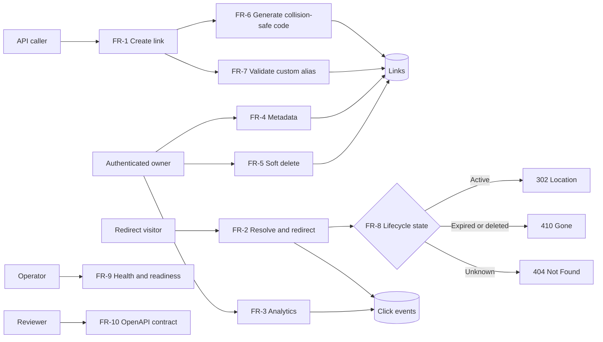
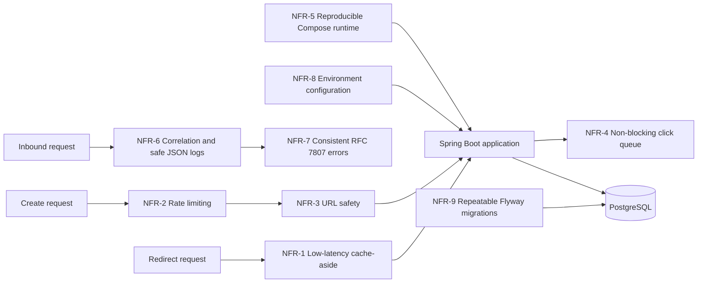
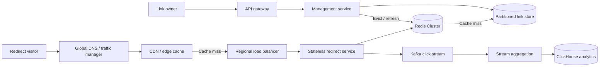
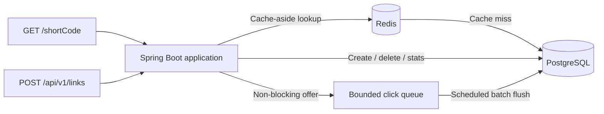
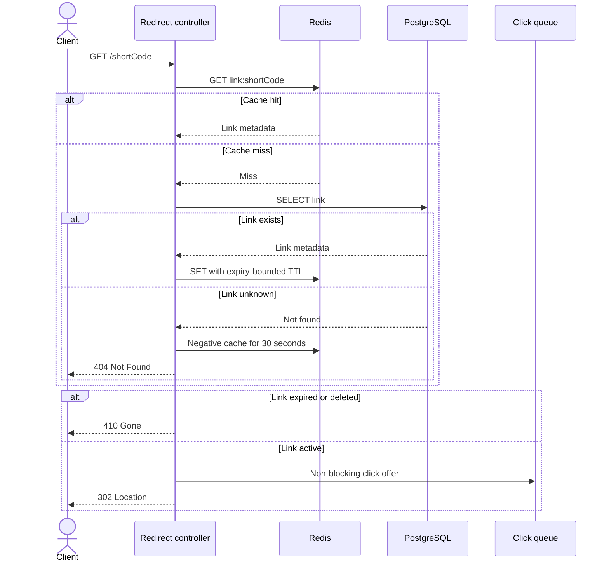

# URL Shortener — Design Specification

**Stack:** Java 21 · Spring Boot 3.5 · PostgreSQL 16 · Redis 7 · Maven
**Document status:** Approved for build.
**Cross-reference convention:** `§n` refers to a section of this document; references to another document are written with its filename (`SCENARIOS.md §2.4`).
**How to read this:** every decision states what we chose, why, and what it cost. The costs are real and stay in the document — a design with no stated downsides hasn't been thought through.

---

## 1. Problem statement

A service that maps long URLs to short codes, redirects on lookup, records click analytics, and remains available under read-heavy load.

The single most important property: **reads dominate writes by roughly 100:1.** Nearly every architectural decision below follows from that asymmetry.

### Scope boundary

| Built and tested | Documented, not built |
|---|---|
| Single Spring Boot node | Read/write service split |
| Postgres + Redis via Compose | CDN / edge redirect |
| Full API, security, analytics | Kafka click pipeline |
| Graceful degradation | Sharding, multi-region, replicas |

Design targets in §3 describe a production deployment. This prototype targets correctness, testability, security posture, and graceful degradation on one node. Stating the gap is deliberate — the alternative is quoting throughput figures the prototype can't deliver.

---

## 2. Requirements

### Functional

| ID | Requirement |
|---|---|
| FR-1 | `POST /api/v1/links` creates a short link with optional custom alias and expiry |
| FR-2 | `GET /{shortCode}` redirects an active link with `302` |
| FR-3 | `GET /api/v1/links/{shortCode}/stats` returns aggregate click analytics |
| FR-4 | `GET /api/v1/links/{shortCode}` returns owner-safe link metadata |
| FR-5 | `DELETE /api/v1/links/{shortCode}` soft-deletes an owned link |
| FR-6 | Generated short codes are collision-resistant and retry safely on collision |
| FR-7 | Custom aliases are format-, reserved-word-, profanity-, and collision-validated |
| FR-8 | Expired or deleted links return `410`; unknown links return `404` |
| FR-9 | `/healthz` reports liveness and `/readyz` reports dependency readiness |
| FR-10 | OpenAPI documents endpoints, schemas, authentication, and errors |



| ID | Chosen design | Trade-off accepted |
|---|---|---|
| FR-1 | One synchronous transaction returns durable metadata | Higher write latency than acknowledging queued work |
| FR-2 | `302` on every active lookup | More infrastructure traffic than browser-cacheable `301`, but preserves revocation and analytics |
| FR-3 | Event-derived, eventually consistent aggregates with `asOf` | Results can lag and raw events require retention management |
| FR-4 | Owner-authenticated metadata endpoint | Extra authorization lookup; prevents metadata leakage |
| FR-5 | Soft delete plus cache eviction | Rows remain until archival and cache invalidation must be correct |
| FR-6 | Eight-character CSPRNG Base62 code with insert-and-retry | Occasional failed insert instead of predictable sequential allocation |
| FR-7 | Shared namespace and database-enforced uniqueness | Alias inserts can return `409`; profanity lists require maintenance |
| FR-8 | Preserve tombstones to distinguish gone from unknown | Additional lifecycle state and storage compared with hard delete |
| FR-9 | Separate liveness from readiness | More operational surface, but avoids restarting a live process for dependency failure |
| FR-10 | Generated Springdoc OpenAPI plus schema verification | Annotation maintenance and a build-time contract check |

### Non-functional

Each is falsifiable and maps to a named test in §11.

| ID | Requirement | How it's verified |
|---|---|---|
| NFR-1 | Redirect p95 < 50 ms server-side with cache-aside Redis; Redis failure falls through to Postgres | Warm-cache load test and Redis degradation test |
| NFR-2 | Creation is rate-limited per API key and fails closed if the limiter is unavailable | Integration tests assert `429` and limiter-failure `503` |
| NFR-3 | Only safe HTTP(S) targets are accepted; loopback, private, link-local, and unsafe schemes are rejected | SSRF and scheme test matrix |
| NFR-4 | Click tracking never blocks or fails a redirect | Stalled-sink latency and queue-saturation tests |
| NFR-5 | A clean clone runs locally with one `docker compose up --build` command and no paid service | Clean-environment smoke test |
| NFR-6 | JSON logs carry correlation IDs and exclude credentials, raw IPs, and sensitive URL values | Captured-log assertions |
| NFR-7 | API failures use one RFC 7807 JSON shape with documented status codes | Error contract integration tests |
| NFR-8 | Runtime configuration comes from environment variables; secrets are absent from source control | Configuration startup tests and repository secret scan |
| NFR-9 | Flyway migrations create and evolve the schema repeatably | Fresh-database and upgrade migration tests |



| ID | Chosen design | Trade-off accepted |
|---|---|---|
| NFR-1 | Redis cache-aside with expiry-bounded TTL and Postgres fallback | Cache invalidation complexity and slower reads during Redis failure |
| NFR-2 | Redis fixed-window limiter, fail-closed on limiter failure | Up to 2× boundary bursts and temporary write unavailability when Redis fails |
| NFR-3 | Resolve every hostname and reject if any address is unsafe | DNS lookup cost and documented DNS-rebinding limitation |
| NFR-4 | Bounded in-memory queue with non-blocking `offer` | Unflushed or excess click events can be lost |
| NFR-5 | Application, Postgres, and Redis packaged in Compose | First build pulls images and production orchestration remains out of scope |
| NFR-6 | Structured logs with redaction and correlation middleware | Reduced diagnostic detail for sensitive requests |
| NFR-7 | Central `@RestControllerAdvice` emits RFC 7807 | Central mapping must evolve whenever domain failures change |
| NFR-8 | Environment variables with safe defaults and `.env.example` | More explicit startup configuration than embedded development settings |
| NFR-9 | Versioned, forward-only Flyway SQL migrations | Migration discipline and corrective migrations replace ad hoc edits |

### Assumptions

Recorded because they're choices, not facts. If a reviewer disputes one, the design should be revisited, not defended.

- 100K new links/day, 100:1 read:write → ~10M redirects/day
- Links are immutable; changing a target means delete plus create
- Analytics is eventually consistent; exact real-time counts are not required
- Single tenant, API-key auth; no user accounts or UI

---

## 3. Capacity

- Writes: ~1.2/sec average, ~4/sec peak (3×)
- Reads: ~116/sec average, ~350/sec peak
- `links` row: 8 B code + ~200 B target + ~90 B metadata ≈ **300 B**
- `links` at 3 years: 110M rows ≈ **33 GB** — comfortable for single-instance Postgres
- Cache working set at 80/20 ≈ **1.5 GB** — small Redis

**`click_events` dominates storage and is the real capacity constraint.** At 10M redirects/day and ~250 B/row (code, timestamp, truncated referrer and user-agent, `ip_hash`):

| Horizon | Rows | Table | With `idx_clicks_code_time` |
|---|---|---|---|
| 30 days | 300M | ~75 GB | ~95 GB |
| 1 year | 3.7B | ~900 GB | ~1.1 TB |
| 3 years | 11B | ~2.7 TB | ~3.4 TB |

Single-instance Postgres does not hold three years of raw click events. This is not a deferrable nicety — **retention is a launch requirement, not a follow-up.** The design position: `click_events` is a 90-day rolling window (~225 GB, workable), with older data rolled into a `click_daily_agg` table (`short_code`, `day`, `clicks`, `unique_visitors`) at roughly 1/1000th the row count. `clicksLast24h` and `topReferrers` read the raw table; lifetime `totalClicks` reads the aggregate plus the current window.

The aggregate table and rollup job are **not built in the prototype** — see §14.2 — but the retention decision is made here rather than left open, because the numbers above make "deferred" an untenable answer.

**Code length.** Base62 with 8 characters gives 62⁸ ≈ 218 trillion. At 100M stored links, the collision probability on the next draw is ~4.6 × 10⁻⁷. Bounded retry at 5 attempts makes exhaustion negligible. Seven characters would also work; the eighth buys margin cheaply.

### 100-million-user scale-out

"100 million users" is not by itself a capacity requirement: registered owners, daily active creators, and anonymous redirect visitors produce very different loads. For a concrete design target, assume **100M registered owners, 10% daily active, 0.1 links created per active owner per day, and the same 100:1 read:write ratio**. That yields approximately 1M creates/day (~12/sec average), 100M redirects/day (~1,160/sec average), and a 5× design peak of roughly 60 writes/sec and 5,800 reads/sec. Different product usage must be recalculated from these explicit variables rather than hidden behind the user count.

The single-node prototype is not claimed to sustain that workload. The production topology would be:

1. CDN or edge caching for popular redirects, with short TTLs bounded by link expiry and purge on deletion.
2. Stateless redirect nodes behind a load balancer, scaled independently from management nodes.
3. Redis Cluster for the hot redirect working set; cache failure still falls through to durable storage.
4. Postgres primary plus read replicas initially, then hash partitioning or sharding by `short_code` when link volume or write throughput requires it. Ownership indexes remain on the management side.
5. Kafka (or an equivalent durable log) between redirects and analytics, replacing the prototype's in-memory queue.
6. A columnar analytics store such as ClickHouse for time-series and referrer/device aggregations; Postgres remains the source of truth for links.
7. Multi-region routing, regional caches, tested failover, and replication-lag-aware deletion semantics before claiming global availability.



At this scale, 1M creates/day produces about 1.1B links in three years (~330 GB before indexes), while 100M redirects/day produces 9B click events inside a 90-day raw retention window. Those numbers make partitioned link storage, streaming ingestion, rollups, and retention operational requirements rather than optional optimizations.

The prototype demonstrates the decisions that survive that evolution: immutable link mappings, collision-safe generation, cache-aside reads, expiry-bounded TTLs, non-blocking analytics, explicit failure behavior, and independently testable interfaces. It demonstrates the **scale-out path**, not 100M-user capacity on one node.

---

## 4. Architecture



**Modular monolith**, two top-level packages with no cross-package calls:

```
com.example.shortener
├── redirect/           # hot path — resolve, cache, redirect
│   ├── RedirectController
│   ├── LinkResolver
│   └── LinkCache
├── management/         # cold path — create, delete, stats
│   ├── LinkController
│   ├── LinkService
│   ├── ShortCodeGenerator
│   └── AliasValidator
├── analytics/
│   ├── ClickRecorder          # bounded queue, non-blocking
│   ├── ClickFlusher           # @Scheduled batch insert
│   └── StatsService
├── security/
│   ├── UrlSafetyValidator     # scheme + SSRF
│   ├── ApiKeyFilter
│   └── RateLimiter            # Redis-backed
├── common/
│   ├── LinkEntity, LinkRepository
│   ├── Base62
│   └── GlobalExceptionHandler
└── config/
```

**Decision: one deployable, not microservices.**
*Why:* at this scale a split adds deployment, network, and observability cost with no benefit. The package boundary between `redirect` and `management` is the future service seam — enforce it now, split later if the read path saturates first.
*Cost:* both paths scale together. Accepted; documented as the first thing to change under load.

---

## 5. Data model

```sql
CREATE TABLE links (
    short_code      VARCHAR(32)   PRIMARY KEY,   -- 8 for generated; up to 32 for custom aliases (§8)
    target_url      VARCHAR(2048) NOT NULL,
    created_at      TIMESTAMPTZ   NOT NULL DEFAULT now(),
    expires_at      TIMESTAMPTZ,
    deleted_at      TIMESTAMPTZ,
    owner_key_id    VARCHAR(64)   NOT NULL,
    is_custom_alias BOOLEAN       NOT NULL DEFAULT false
);

CREATE INDEX idx_links_owner  ON links (owner_key_id);
CREATE INDEX idx_links_expiry ON links (expires_at) WHERE expires_at IS NOT NULL;

CREATE TABLE click_events (
    id          BIGSERIAL   PRIMARY KEY,
    short_code  VARCHAR(32) NOT NULL REFERENCES links(short_code),
    occurred_at TIMESTAMPTZ NOT NULL,
    referrer    VARCHAR(512),
    user_agent  VARCHAR(512),
    ip_hash     CHAR(64)
);

CREATE INDEX idx_clicks_code_time ON click_events (short_code, occurred_at DESC);
```

Managed by **Flyway** so schema changes are versioned and reviewable rather than hidden in JPA auto-DDL.

**`VARCHAR(32)`, sized to the alias rule, not the generated code.** Generated codes are 8 characters; the alias charset rule in §8 permits up to 32. The column is the union of both, and the two numbers are kept in one place — `AliasValidator`'s max length is a constant referenced by both the regex and a schema assertion test (T-14), so the next person to widen the alias rule cannot silently outgrow the column.

**The FK is retained, and the archival job in §10 respects it.** `click_events` references `links`, so the cleanup job cannot hard-delete link rows while their events remain. It runs children-first inside one transaction — archive the code's events, then the link row — and never issues an unqualified `DELETE FROM links`. `ON DELETE CASCADE` was rejected: silently discarding click history as a side effect of a lifecycle job is exactly the kind of data loss that should require an explicit statement.

**`short_code` as primary key, not a surrogate id.**
*Why:* it's the hot-path lookup. PK gives the B-tree index and the uniqueness constraint in one move.
*Cost:* a natural key in a URL is effectively permanent. Accepted — that's the product.

**Custom aliases share the key space with generated codes.**
*Why:* one column, one lookup, one constraint. Separate namespaces would double the resolution logic.
*Cost:* an alias can collide with a future generated code. Handled by retry on the generated side.

**`ip_hash`, not raw IP.** Analytics needs uniqueness, not identity. Storing raw IPs creates a PII obligation the feature doesn't need.

A single static salt is not sufficient here: the IPv4 space is 2³² candidates, so anyone holding the salt and the table can recover every source address by exhaustive search in minutes. The salt is therefore **rotated daily** — `HMAC-SHA256(salt_for(day), ip)` — with the salt held in the deployment's secret store and never in configuration or logs. Yesterday's salt is discarded, which makes yesterday's hashes permanently unlinkable.

*Cost:* uniqueness is only computable within a single day. `uniqueVisitors` over a longer window is therefore a sum of daily uniques, which over-counts a visitor returning on multiple days. That is the correct trade: an approximate metric beats a reversible identifier.

**Soft delete via `deleted_at`.** Lets a deleted code return `410` rather than `404`. "Gone" and "never existed" are different facts and clients act on them differently.

**Per-click rows, not a counter column.**
*Why:* a counter can't answer "clicks last week." Aggregates derive from events; events don't derive from aggregates.
*Cost:* table growth is linear in traffic, ~11B rows over three years (§3). Bounded by the 90-day raw window plus daily aggregates decided in §3; the rollup itself is a documented gap, not an open question.

---

## 6. Short code generation

**Decision: `SecureRandom` → 8 base62 chars → insert → retry on constraint violation, max 5 attempts.**

```java
public interface ShortCodeGenerator {
    String generate();   // 8 chars from [A-Za-z0-9]
}
```

Insert, catch `DataIntegrityViolationException`, regenerate, retry. No pre-check — the insert *is* the check, so there's no read-then-write race.

**Why not a Redis counter (`INCR` + base62):** it puts Redis on the write path. Redis down would mean no links can be created at all. With random generation Redis is purely a cache — Redis down means slower reads, fully functional service. That difference is the reliability story, and it makes NFR-1's degradation behavior testable instead of merely claimed.

Sequential codes are also enumerable: an attacker can walk the space and harvest every link, and the code leaks issuance volume. Fixing that needs a Feistel or XOR obfuscation layer — complexity to recover a property random generation has for free.

**Why not a truncated hash:** truncation reintroduces collisions, so retry logic is needed anyway, and determinism forces URL canonicalization to be correct or the same link yields different codes. Same cost, extra coupling.

**Why not Snowflake:** needs a coordination service for worker IDs and fails on clock skew. Wrong complexity for one node.

**Cost of the choice:** each create does a DB round-trip that can occasionally fail and retry. At 4 writes/sec peak this is irrelevant.

**When all 5 attempts fail → `503` with `Retry-After: 1`.** At the modelled scale this is astronomically improbable (~10⁻³² for five independent collisions), so if it ever fires the cause is almost certainly *not* a genuinely exhausted key space — it is a broken RNG, a misconfigured code length, or Postgres rejecting inserts for an unrelated reason. `503` says "transient, try again," which is the honest answer in every one of those cases; `500` would invite a client to give up permanently on what is most likely a recoverable condition. The handler logs at `ERROR` with the attempt count and fires a dedicated counter metric, because a single occurrence is a signal worth paging on rather than a routine retry. Covered by T-15.

---

## 7. API contract

Base path `/api/v1`. Auth via `Authorization: Bearer <key>` — header only, never query or body, because those land in access and proxy logs.

### `POST /api/v1/links` → `201`

```json
{ "targetUrl": "https://example.com/long/path",
  "customAlias": "q3-campaign",
  "expiresAt": "2026-12-31T23:59:59Z" }
```
```json
{ "shortCode": "aK3nR7pQ",
  "shortUrl": "https://sho.rt/aK3nR7pQ",
  "targetUrl": "https://example.com/long/path",
  "createdAt": "2026-08-27T14:02:11Z",
  "expiresAt": "2026-12-31T23:59:59Z" }
```

| Status | Condition |
|---|---|
| `400` | Malformed URL, bad alias format, expiry in the past |
| `401` | Missing or invalid API key |
| `409` | Custom alias already taken |
| `422` | Target rejected by security validation |
| `429` | Rate limit exceeded |

`422` is separated from `400` on purpose: the request was well-formed, the target isn't acceptable. Clients need to tell "you typed it wrong" from "we won't shorten that."

### `GET /{shortCode}`

Root path — short URLs must be short.

| Status | Condition |
|---|---|
| `302` + `Location` | Valid, unexpired, not deleted |
| `404` | Never existed |
| `410` | Expired or deleted |

**302, not 301.** 301 is cached by the browser, so repeat clicks never reach the service and click counts silently undercount — and the link becomes un-revocable in practice.
*Cost:* every click hits our infrastructure. That's what the cache layer is for.

### `DELETE /api/v1/links/{shortCode}` → `204`, `403` if the key doesn't own it

### `GET /api/v1/links/{shortCode}/stats` → `200`

```json
{ "shortCode": "aK3nR7pQ",
  "totalClicks": 1420,
  "uniqueVisitors": 981,
  "clicksLast24h": 37,
  "topReferrers": [{ "referrer": "twitter.com", "count": 622 }],
  "asOf": "2026-08-27T14:05:00Z" }
```

`asOf` makes eventual consistency visible rather than implying real-time accuracy.

### Error shape (RFC 7807)

```json
{ "type": "https://sho.rt/errors/alias-taken",
  "title": "Alias already in use",
  "status": 409,
  "detail": "The alias 'q3-campaign' is taken.",
  "instance": "/api/v1/links" }
```

One `@RestControllerAdvice` produces every error. Never leak stack traces or SQL.

---

## 8. Custom aliases

Validate in order, all before touching the database:

1. Charset `^[a-zA-Z0-9_-]{3,32}$`
2. Not reserved: `api`, `admin`, `health`, `actuator`, `metrics`, `login`, `static`, `favicon.ico`
3. Not a profanity-list match

Then a single insert. **No check-then-write** — two requests can both see an alias as free, and one ends up corrupt or failing unpredictably. Push uniqueness to the storage layer: insert, catch the violation, return `409`.

Same mechanism as generated codes, different handler: generated retries, alias returns `409`.

This race deserves an explicit concurrent test — two threads, same alias, assert exactly one `201` and one `409`. It proves the design, not just the code.

---

## 9. Redirect path and caching



**Cache TTL rule:**

```
cacheTtl = min(defaultTtl, link.remainingLifetime)
```

Without this, a link expiring in 5 minutes but cached for 24 hours keeps redirecting for 23 hours 55 minutes past expiry. That's a security defect, not a staleness annoyance.

**Negative caching.** Cache misses for unknown codes briefly (~30 s), or a flood of random codes becomes a Postgres DoS. Kept short so a code created just after being probed isn't shadowed.

**Degradation — Redis unavailable.** Log, increment a metric, fall through to Postgres. Never fail a redirect because the cache is down. This is part of NFR-1 and gets a test that stops the Redis container mid-run. Rate limiting fails **closed** in this state (creation returns `503`) while redirects fail **open**: losing the limiter is a security control failure on a write path, losing the cache is a performance failure on a read path, and they do not deserve the same answer.

**Degradation — Postgres unavailable.** The prototype's other dependency needs a stated answer too, and it is not symmetrical with the Redis case:

| Path | Behavior |
|---|---|
| Redirect, cache hit | Served normally. Postgres is not on the hot path when warm. |
| Redirect, cache miss | `503` + `Retry-After`. There is nowhere else to resolve the code from. |
| Create / delete | `503`. Never queue writes in memory — a client that received `201` must be able to trust it. |
| Analytics flush | Buffer retains up to the queue bound, then drops. No redirect impact. |
| `/actuator/health` | `DOWN`, so an orchestrator stops routing rather than a node absorbing traffic it cannot serve. |

Enforced by bounded timeouts rather than hope: HikariCP `connection-timeout` 2 s, JDBC `socketTimeout` 5 s, and a circuit breaker around `LinkRepository` that opens after sustained failure so requests fail in milliseconds instead of piling up threads until the container is unresponsive. **Failing fast is the feature** — an exhausted connection pool takes down cached redirects that would otherwise have been served fine. Tested by T-13.

**Cost:** cache and DB can diverge on delete. Mitigated by explicit eviction on delete plus bounded TTL.

---

## 10. Expiration, security, analytics

### Expiration — hybrid

1. **Passive check on read** — compare `expires_at` at redirect. Exact-instant expiry, negligible cost.
2. **Lazy cleanup** — daily job archives long-expired rows. Prevents unbounded growth without continuous DB load. Because `click_events` holds a foreign key to `links`, the job archives **children first, then the parent, in one transaction**, batched by code (§5). Ordering it the other way makes the job fail on its first run against any link that was ever clicked.
3. **Bounded cache TTL** — §9.

All three are required. Passive alone leaks storage. Active alone leaves a window where expired links still resolve. Either alone with an unbounded cache TTL is simply incorrect.

### Security

This is the strongest differentiator in the build, and most reference designs skip it.

**Scheme allowlist — `http` and `https` only.** Rejecting `javascript:`, `data:`, `file:` is not optional. A shortener that redirects to `javascript:` is a stored-XSS delivery service.

**SSRF blocking.** Resolve the target host and reject loopback (`127.0.0.0/8`, `::1`), private ranges (`10/8`, `172.16/12`, `192.168/16`), link-local (`169.254.0.0/16`, notably the `169.254.169.254` cloud metadata endpoint), and `.internal` / `.local` / unqualified hostnames. Without this the service is a willing proxy for probing internal infrastructure from outside the perimeter.

**Rate limiting.** Redis-backed fixed window per API key on creation; `429` with `Retry-After`. This is Redis's second job — one dependency serving two requirements, which is part of why it earns its place.

*Known property of fixed windows:* a caller can spend a full quota at the end of one window and another at the start of the next, producing up to **2× the nominal rate** across the boundary. Accepted for the prototype — the limiter exists to bound abuse and protect the write path, not to meter billing, and a 2× burst does neither harm at 4 writes/sec peak. A sliding-window-counter variant closes it with one extra Redis key and interpolation, and is the stated upgrade if the limit ever becomes a commercial boundary rather than a safety one. T-9 asserts the limit; it does not assert the boundary behavior, which is a deliberate scoping choice rather than an oversight.

**Known limitation — DNS rebinding.** Validation at creation and resolution at redirect are different moments. An attacker controlling DNS can pass validation and later point at an internal address. Full mitigation means resolving and pinning at redirect time. Documented rather than built; a stated gap is a stronger signal than an unstated one.

**Open redirect.** A URL shortener *is* an open redirect — that's the product, and it can't be designed away. What we do instead: scheme allowlist, SSRF blocking, rate limiting, ownership, revocability. Saying so plainly beats pretending the risk category doesn't exist.

### Analytics — buffered, async

Redirect publishes to a **bounded** in-memory queue and returns immediately. A `@Scheduled` flusher batch-inserts to `click_events` every few seconds or when the batch fills.

**Cost, stated plainly:** buffered-but-unflushed clicks are lost if the process dies. Acceptable for analytics, unacceptable for anything transactional — which is exactly why link creation is synchronous and click recording is not. The bounded queue also means events are *dropped* under extreme load rather than queued into an OOM. Dropping analytics beats taking down redirects.

**What counts as a click:** a successful `302` only. Expired, deleted, and invalid lookups excluded. Known bots flagged, not dropped, so raw data stays honest and filtering is a query concern.

**Scale-out path:** replace the queue with Kafka when per-click durability is required or the flusher can't keep up. The `ClickRecorder` interface is the seam.

---

## 11. Testing

Integration tests run against **real Postgres and Redis via Testcontainers**, not mocks. Mocking the datastore would mock away the unique constraint — the exact mechanism T-2 and T-3 exist to verify.

| ID | Test | Proves |
|---|---|---|
| T-1 | Create then redirect, end to end | FR-1, FR-2 |
| T-2 | Concurrent identical alias, 2 threads | FR-7, §8 |
| T-3 | Forced collision via seeded generator | FR-6 |
| T-4 | Expired link returns `410` | FR-8 |
| T-5 | Expired link with warm cache still `410` | FR-8, NFR-1, §9 TTL rule |
| T-6 | Redis stopped mid-run, redirects continue | NFR-1 |
| T-7 | `javascript:` / `data:` targets rejected | NFR-3, §10 |
| T-8 | `169.254.169.254` and private ranges rejected | NFR-3, §10 |
| T-9 | Rate limit returns `429`; unavailable limiter returns `503` | NFR-2 |
| T-10 | Deleted `410`, unknown `404` | FR-5, FR-8 |
| T-11 | Analytics sink stalled, redirect latency flat | NFR-4 |
| T-12 | Load test, p95 measured and recorded | NFR-1 |
| T-13 | Postgres stopped: cached codes still `302`, uncached `503`, create `503` within timeout budget | §9 failure behavior |
| T-14 | Max-length (32-char) alias round-trips; `AliasValidator` max ≤ column width | FR-7, §5, §8 |
| T-15 | Generator stubbed to always collide → `503`, exactly 5 attempts, metric incremented | FR-6, §6 |
| T-16 | Archival job removes a clicked, long-expired link without FK violation | FR-8, §5, §10 |
| T-17 | Stats contract returns totals, first/last click, referrer/device breakdown, and `asOf` | FR-3 |
| T-18 | Metadata requires ownership and excludes sensitive fields | FR-4 |
| T-19 | Liveness stays up while readiness reflects dependency failure | FR-9 |
| T-20 | Generated OpenAPI contains every endpoint, auth scheme, response, and error schema | FR-10 |
| T-21 | Clean-clone Compose smoke test starts the full application | NFR-5 |
| T-22 | Captured logs are JSON, correlated, and redact secrets, raw IPs, and sensitive URL values | NFR-6 |
| T-23 | Representative failures conform to the RFC 7807 schema | NFR-7 |
| T-24 | Environment overrides load correctly and repository secret scan is clean | NFR-8 |
| T-25 | Flyway succeeds against a fresh database and upgrades from the prior schema | NFR-9 |

**Quality gates:** Spotless (format), SpotBugs (static analysis), JaCoCo (coverage floor 80% on service classes), OWASP dependency-check. All wired into `mvn verify` so they fail the build rather than being optional.

---

## 12. Build order

Sequenced so a runnable system exists early and each step has a test that proves it.

| # | Step | Done when |
|---|---|---|
| 1 | Flyway migration, `links` table | Schema applies clean on fresh container |
| 2 | `Base62` + `ShortCodeGenerator` | Unit tests pass, T-3 |
| 3 | `POST /links` + `GET /{code}`, no cache, no analytics | **First runnable end-to-end**, T-1 |
| 4 | `UrlSafetyValidator` | T-7, T-8 |
| 5 | Expiry + delete | T-4, T-10 |
| 6 | Custom aliases | T-2 |
| 7 | **Redis cache** | T-5, T-6 |
| 8 | Analytics + stats endpoint | T-11 |
| 9 | Rate limiting | T-9 |
| 10 | Load test, OpenAPI, README | T-12 |

Two checkpoints matter. **Step 3** gives a working system before anything is optimized. **Step 7** is deliberately late so introducing the cache is a real change against an existing, tested codebase — which is what a brownfield scenario should look like.

---

## 13. Local setup

```yaml
# docker-compose.yml
services:
  postgres:
    image: postgres:16-alpine
    environment: { POSTGRES_DB: shortener, POSTGRES_PASSWORD: dev }
    ports: ["5432:5432"]
  redis:
    image: redis:7-alpine
    ports: ["6379:6379"]
```

```bash
docker compose up -d
./mvnw spring-boot:run
```

Two commands from clone to a working redirect. Every extra dependency is a chance the reviewer's machine behaves differently from yours — two containers is the ceiling.

Key dependencies: `spring-boot-starter-web`, `-data-jpa`, `-data-redis`, `-validation`, `-actuator`, `flyway-core`, `postgresql`, `springdoc-openapi-starter-webmvc-ui`, `testcontainers` (postgres, junit-jupiter).

---

## 14. Open questions

Recorded because "considered and declined" reads better than silence.

1. Idempotent creation via `Idempotency-Key`? **Deferred.**
2. Retention for `click_events` — **decided, partially built.** §3 sizes the table and commits to a 90-day raw window plus daily aggregates. The prototype builds neither the rollup job nor `click_daily_agg`; `totalClicks` therefore reads raw and would be wrong once the window starts truncating. This is the single largest gap between the design and the running system, and it is a correctness limitation, not a performance one.
3. Per-country analytics needs geo-IP and raises privacy questions. **Out of scope.**
4. Link updates — currently immutable. Revisit if a use case appears.
5. Custom aliases are chosen by the caller and are therefore guessable by construction — FR-6's unguessability property deliberately covers generated codes only. A caller who needs unguessability must not supply an alias. **Accepted; documented rather than enforced**, since refusing predictable aliases would defeat the feature's purpose.
6. Sliding-window rate limiting to remove the 2× boundary burst (§10). **Deferred.**
